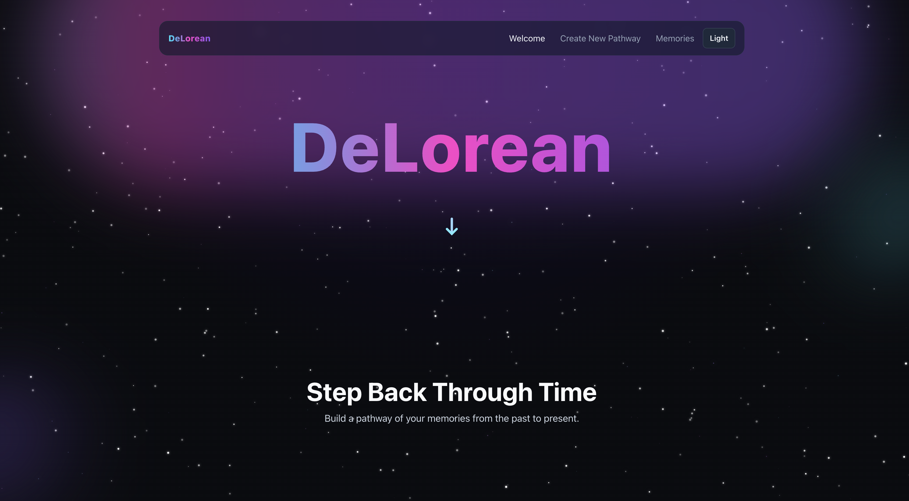
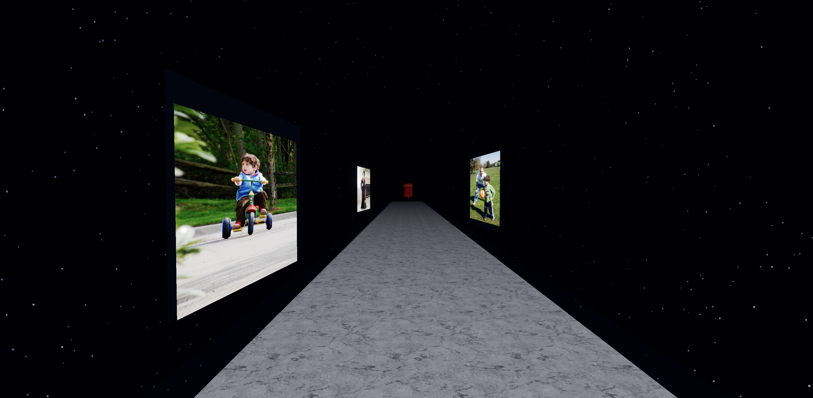
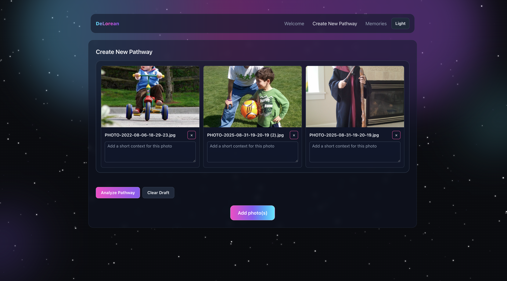

# DeLorean · DubHacks 2025

Built in 24 hours at the University of Washington's DubHacks 2025 hackathon, DeLorean is a virtual memory exhibit that lets you walk through your past in 3D. Drop in the photos that defined your year, step into a procedurally generated tunnel, and listen as an AI narrator strings those snapshots into a single story using ElevenLabs voice synthesis.

---

## Hackathon Highlights

- **Theme fit**: We set out to explore the hackathon theme of "time travel through lived experience" by recreating the feeling of paging through an old photo album.
- **Team roles**: Atakan Toprakbasti and Azib Malik built the server-side APIs, while Stefano Cipolla crafted the website front end and Three.js client experience.
- **What we finished in time**: Full upload workflow, automated asset conversion, generative narration, and a guided memory replay that worked on the demo stage.
- **What we would add post-hackathon**: Multi-user memory sharing, collaborative timelines, and mobile AR mode for on-the-go nostalgia.

---

## Features

- Upload personal images to build a 3D memory tunnel rendered in Three.js.
- Auto-normalize image formats (including HEIC/HEIF) to WebP for smooth playback.
- AI narration for each photo—Gemini drafts the script, ElevenLabs voices it—including a final stitched "life story" voiceover.
- Seamless camera walkthrough with ambient audio and timing synced to narration.
- Curated memory book at the end of the tunnel that bundles every story, lets you click the cover, and downloads the full narrative locally.
- Real-time progress feedback so demo judges know when narration is ready.

---

## Screenshots





---

## System Overview

| Layer  | Tech                   | Responsibilities                                                    |
| ------ | ---------------------- | ------------------------------------------------------------------- |
| Client | React + Vite, Three.js | Upload UI, tunnel renderer, animation timing, narration playback    |
| Server | Node.js + Express      | File uploads, Sharp image processing, Gemini prompt orchestration   |
| AI     | Google Gemini + ElevenLabs | Gemini handles per-memory and final-story text; ElevenLabs renders the voiceover audio |

Uploaded assets live under `server/uploads`, with metadata tracked in `server/data/uploads.json`. Narrative audio is generated on demand via ElevenLabs and streamed back to the client.

---

## Getting Started Locally

1. Clone the repo and install dependencies in both workspaces.
   - `cd server && npm install`
   - `cd client && npm install`
2. Provision Google Gemini and ElevenLabs API keys (or reuse existing ones) and add them to `server/.env`:

   ```env
   GEMINI_API_KEY=your-key-here
   GEMINI_MODEL=gemini-2.5-flash # optional override
   ELEVENLABS_API_KEY=your-elevenlabs-key
   ELEVENLABS_VOICE_ID=voice-id # optional if you want a custom voice
   CLIENT_ORIGIN=http://localhost:5173 # optional if the frontend serves elsewhere
   ```

3. Run the services in separate terminals:
   - Server: `cd server && npm run dev` (Express on `http://localhost:4000`)
   - Client: `cd client && npm run dev` (Vite on `http://localhost:5173`)
4. Open the client, upload a set of memories, and wait for the automated narration to finish generating before stepping through the tunnel.

---

## API Notes

- `POST /api/uploads` accepts `multipart/form-data` with `images` plus optional `context` or `contexts` text. It responds with stored context and stub narration metadata.
- `GET /api/uploads` returns the current gallery for the session.
- `POST /api/uploads/:id/story` triggers Gemini narration for the specified memory.
- `DELETE /api/uploads/:id` removes a memory and its generated media.
- `GET /api/message`, `POST /api/echo`, and `GET /health` provide diagnostics the team used during the hackathon.

---

## Tech Stack

- Frontend: React, Vite, Three.js, Zustand, Tailwind CSS
- Backend: Node.js, Express, Multer, Sharp
- AI Services: Google Gemini (story generation), ElevenLabs (text-to-speech)
- Tooling: Nodemon, ESLint, Prettier

---

## Credits

- Atakan Toprakbasti — Backend engineering, upload pipeline, hackathon caffeine logistics
- Azib Malik — Backend engineering, AI orchestration, narration tooling
- Stefano Cipolla — Website frontend and 3D experience, user storytelling flow

Built collaboratively over a single DubHacks 2025 weekend. Big thanks to the University of Washington organizers, mentors, and the late-night Red Bull stash that kept us shipping.
